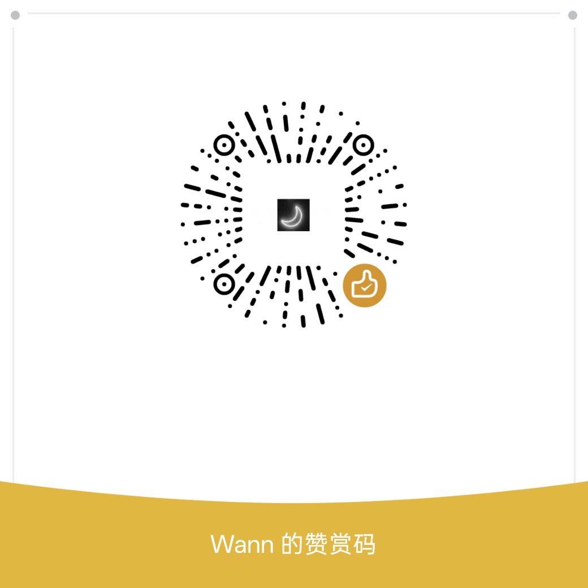

# TaTa

> A desktop multimedia processing tool based on ffmpeg and Real-ESRGAN / SRMD. Supports anime video upscaling to 4K, image restoration, image format conversion, file utilities, and audio/video tools.

[](./src-tauri/tauri.conf.json)
[](https://tauri.app)
[](https://vuejs.org)
[](#download-and-installation)

This project is an optimized redevelopment based on [mp4To4K-rust](https://github.com/Minori-ty/mp4To4K-rust). It fixes the issues of the original project and continuously adds new features. If you find this software helpful, please consider giving it a Star.

[简体中文](./README.md) | English

---

## Table of Contents

- [Features](#features)
- [Tech Stack](#tech-stack)
- [Project Structure](#project-structure)
- [Development Guide](#development-guide)
- [Build](#build)
- [Download and Installation](#download-and-installation)
- [Usage](#usage)
- [FAQ](#faq)
- [Changelog](#changelog)
- [Open Source Maintenance Notes](#open-source-maintenance-notes)
- [Acknowledgements](#acknowledgements)
- [License](#license)
- [Buy Me a Coffee](#buy-me-a-coffee)

---

## Features

### Image and Video Restoration

- **Image Restoration**: Supports drag-and-drop / batch image processing. Choose between Real-ESRGAN or SRMD models and scaling factors.
- **Video to 4K**: Select model, encoder, video extension, and thread count for batch video super-resolution.

### Image Format Conversion

- Supports conversion between **21 image formats** (PNG / JPEG / GIF / BMP / TIFF / WebP / ICO / TGA / PNM / HDR / DDS / QOI / HEIC / RAW / PSD / SVG / PDF, etc.)
- **Dual Mode Switching**:
  - **Native Mode (Default)**: Processed by the Rust `image` crate. No extra dependencies needed. Covers common formats.
  - **ImageMagick Mode**: Calls the local `magick` executable. Supports all 21 formats (ImageMagick installation required).
- Scaling options: No scaling / By width / By height / Fixed width and height / By percentage

### File Utilities

- **File Upgrade**: Extract all files from subfolders of the selected folder into the current directory.
- **Batch Rename**: Batch rename all files in a folder based on selected rules.
- **Filename Extraction**: Batch extract filenames.
- **Merge & Hide**: Merge an image with a compressed archive for hidden storage.

### Audio/Video Tools

- **Audio Extraction**: Batch extract audio from videos to the same directory.
- **Video Format Conversion**: Batch convert videos to a specified format.
- **Video Speed Conversion**
- **AI Command Line Mode**: After configuring the [Tongyi Qianwen API Key](https://help.aliyun.com/zh/model-studio/getting-started/first-api-call-to-qwen), generate ffmpeg commands from natural language descriptions and execute them.

### Other Features

- **Dark Mode**: Supports light / dark appearance switching.
- **System Tray**: Minimize to tray. Right-click menu supports show / hide / exit.
- **Custom Title Bar**: Native window controls (minimize, maximize, close) + drag-to-move.
- **Operation History & Undo**: Records file operation history and supports undo.
- **System Notifications**: Push system notifications when tasks are completed.
- **Global Shortcuts**: Supports custom global shortcuts.

---

## Tech Stack

| Layer | Technology | Description |
|------|------|------|
| Frontend Framework | Vue 3 + TypeScript | Composition API |
| Build Tool | Vite 5 | Development and bundling |
| UI Component Library | Element Plus 2.7 | Automatic on-demand import |
| Routing | Vue Router 4 | Hash mode |
| Desktop Framework | Tauri v2 | Rust backend |
| Backend Language | Rust (edition 2021) | Async tokio |
| Image Processing | image crate 0.25 | Rust native image codec |
| HTTP Client | reqwest 0.11 | Rust-side proxy requests |
| AI SDK | openai 4.x | Tongyi Qianwen / GPT command generation |
| External Binaries | ffmpeg / ffprobe / realesrgan-ncnn-vulkan / srmd-ncnn-vulkan | Packaged as sidecars |

---

## Project Structure

```
Tata/
├── src/                        # Frontend source code
│   ├── components/             # Page components (pic-job / video-job / file-job / media / img-convert / setting / copyright)
│   ├── script/                 # Business logic (video processing, file tools, AI, settings, image formats, etc.)
│   ├── router/                 # Routing configuration
│   ├── store/                  # Global state
│   ├── system/                 # Window operations
│   ├── utils/                  # Utility functions
│   └── assets/                 # Static resources and theme styles
├── src-tauri/                  # Tauri backend
│   ├── src/main.rs             # Rust entry point (tray, custom commands)
│   ├── bin/                    # External executables (ffmpeg / realesrgan / srmd)
│   ├── models/                 # Real-ESRGAN models
│   ├── models-srmd/            # SRMD models
│   ├── conf/user.conf          # User configuration file
│   ├── capabilities/           # Tauri v2 permission configuration
│   └── tauri.conf.json         # Tauri core configuration
├── package.json
└── vite.config.ts
```

For detailed architecture and component descriptions, see [AGENTS.md](./AGENTS.md).

---

## Development Guide

### Requirements

- [Node.js](https://nodejs.org/) 18+ with npm / yarn
- [Rust](https://www.rust-lang.org/) 1.80+ (with cargo)
- [Tauri CLI v2](https://tauri.app/start/prerequisites/) system dependencies

### Steps

1. **Clone the code**

   ```bash
   git clone https://github.com/wann-he/TataRepair.git
   cd TataRepair
   ```

2. **Download external binaries and models** (not included in the repository)

   Place the following files in the corresponding directories:

   | File | Target Directory |
   |------|----------|
   | `ffmpeg.exe` / `ffprobe.exe` | `src-tauri/bin/ffmpeg/` |
   | `realesrgan-ncnn-vulkan.exe` | `src-tauri/bin/realesrgan/` |
   | `srmd-ncnn-vulkan.exe` | `src-tauri/bin/srmd/` |
   | Real-ESRGAN trained models (e.g., `realesr-animevideov3-x4.pth`, etc.) | `src-tauri/models/` |
   | SRMD models | `src-tauri/models-srmd/` |

   > Download sources:
   > - ffmpeg: <https://www.gyan.dev/ffmpeg/builds/> or <https://github.com/BtbN/FFmpeg-Builds/releases>
   > - Real-ESRGAN: <https://github.com/xinntao/Real-ESRGAN/releases>
   > - SRMD: <https://github.com/cszn/SRMD> (requires self-compilation or prebuilt version)

3. **Install dependencies**

   ```bash
   npm install
   # or
   yarn
   ```

4. **Start development mode**

   ```bash
   npm run tauri:dev
   ```

---

## Build

```bash
npm run tauri:build
```

After the build is complete, you can find the relevant files in the `src-tauri/target/release/bundle/` directory:

- `nsis/` directory contains the `.exe` installer
- `msi/` directory contains the `.msi` installer (if enabled)

> The default build target is `nsis`, using the NSIS installer. To change the target, modify the `bundle.targets` field in `src-tauri/tauri.conf.json`.

---

## Download and Installation

- Go to the [Releases page](https://github.com/wann-he/TataRepair/releases) to download the latest version.
- Double-click the `.exe` installer and follow the prompts to complete installation.
- **It is recommended not to install on the C drive**, as writing configuration files may fail due to permission issues.

> Currently, only Windows packaging is configured. For more platform configurations, see the [Tauri official documentation](https://tauri.app/).

---

## Usage

### AI Command Line Mode

1. Go to [Alibaba Cloud Bailian](https://help.aliyun.com/zh/model-studio/getting-started/first-api-call-to-qwen) to enable Tongyi Qianwen service and obtain an API Key.
2. Enter the API Key in the app "Settings" page and select a model.
3. In "Audio/Video Tools - Command Line Mode - AI", describe your needs in natural language, and AI will generate the ffmpeg command.
4. You can also directly enter the ffmpeg command in the "Generate Command" box and execute it.

> Note: Only ffmpeg commands are supported; other commands cannot be executed.

### Image Conversion Mode Switching

- **Native Mode**: Works out of the box. Supports common formats.
- **ImageMagick Mode**: Requires installing [ImageMagick](https://imagemagick.org/download/#gsc.tab=0), configuring the `magick` executable path in the settings page, and clicking "Test Availability" to verify.

### Configuration File

User configuration is saved in `conf/user.conf` with the following structure:

```json
{
  "gpt": { "ak": "" },
  "qwen": {
    "ak": "",
    "models": ["qwen-plus", "qwen-max", "qwen-turbo"],
    "optional_models": ["qwen-plus", "qwen-max", "qwen-turbo"]
  },
  "img_convert": {
    "mode": "native",
    "magick_path": ""
  }
}
```

Configuration reading provides fallback defaults for missing fields to ensure backward compatibility.

---

## FAQ

**Q: Video super-resolution is very slow?**
A: Video tasks are highly dependent on hardware. Reference data from the original author: a 5-second video upscaled 4x takes about 5-8 minutes. In practice, on a 6-core 16GB Win11 computer, 2x upscaling of a 5s 360P video with 5 threads takes more than 2 minutes. If your computer configuration is modest, please be cautious with the "multi-thread" option, as it may cause the computer to freeze.

**Q: Real-ESRGAN doesn't work well on real-person videos?**
A: realesrgan-related models are suitable for animation and cartoon-related image restoration and may not perform well on other types of videos. You can try switching to the SRMD model for old photo / old video restoration.

**Q: I don't know what a configuration option means?**
A: Just use the default options.

**Q: Configuration write failed?**
A: Try not to install the software on the C drive, as writing configuration may fail due to permission issues.

---

## Changelog

### v0.0.10

- Added image format conversion (21 formats, dual mode: native / ImageMagick)
- Added SRMD model support (old photo restoration)
- Added system tray (minimize to tray + right-click menu)
- Added operation history and undo functionality
- Added system notifications and global shortcut support
- Upgraded to Tauri v2
- Optimized user configuration backward compatibility

### v0.0.8

- Added file utilities: file upgrade, batch rename
- Added audio/video tools: audio extraction, video format conversion
- Added dark mode
- Added AI command line mode (Tongyi Qianwen generates ffmpeg commands)

### v0.0.3 and earlier

- Basic image restoration and video to 4K functionality
- Optimized redevelopment based on [mp4To4K-rust](https://github.com/Minori-ty/mp4To4K-rust)

---

## Open Source Maintenance Notes

The following notes are for contributors and maintainers during the maintenance of this project:

### 1. License Compliance

- This project uses [ffmpeg](https://github.com/FFmpeg/FFmpeg) under the **GPL license** and [Real-ESRGAN](https://github.com/xinntao/Real-ESRGAN) under the **BSD license**.
- Since ffmpeg uses GPL, the GPL copyleft clause must be considered when distributing; Real-ESRGAN uses BSD, and copyright notices must be retained.
- Secondary development for commercial use is allowed, but the author assumes no responsibility for the consequences of secondary development.

### 2. Large Files and Binary Management

- `ffmpeg`, `ffprobe`, `realesrgan-ncnn-vulkan`, `srmd-ncnn-vulkan` executables and model files are **not included in version control** (excluded in `.gitignore`).
- Users/developers need to download and place them in the corresponding directories as described in the README.
- If distributing prebuilt packages, it is recommended to upload them via **GitHub Releases** rather than committing them to the repository.

### 3. Version Management

- The version number is maintained in the `version` field of `src-tauri/tauri.conf.json`.
- It is recommended to follow [Semantic Versioning](https://semver.org/) (SemVer): `MAJOR.MINOR.PATCH`.
- Update the version number and the "Changelog" section before each release.

### 4. Backward Compatibility

- When the `conf/user.conf` configuration structure changes, `readConfig()` already provides field fallback handling.
- When adding new configuration fields, be sure to provide default values for existing users to avoid configuration failure after upgrade.

### 5. Security Notes

- AI command line mode only allows execution of ffmpeg commands; other commands are rejected.
- Tongyi Qianwen API requests are proxied through the Rust-side `post_request` command to avoid directly exposing the API Key and cross-domain issues in the frontend.
- User API Keys are saved locally in `conf/user.conf` and will not be uploaded to any server.
- **It is recommended to add a `SECURITY.md`** to describe the security vulnerability reporting process.

### 6. Contribution Process Suggestions

- Feedback on bugs or feature suggestions is welcome via Issues.
- PRs should be based on the latest `main` branch and ensure `npm run tauri:dev` starts normally.
- **It is recommended to add `CONTRIBUTING.md`** and `.github/ISSUE_TEMPLATE/` to standardize the collaboration process.

### 7. Release Process

1. Update the `version` field in `src-tauri/tauri.conf.json`.
2. Update the README "Changelog" section.
3. Run `npm run tauri:build` to generate the installer.
4. Create a new Release on GitHub and upload the `.exe` / `.msi` installers.
5. Fill in the Release Notes, noting changes and known issues.

### 8. Academic Citation

Real-ESRGAN is an academic project. If used for research purposes, please cite the relevant papers as required by the upstream repository. See <https://github.com/xinntao/Real-ESRGAN#citation>.

---

## Acknowledgements

- [mp4To4K-rust](https://github.com/Minori-ty/mp4To4K-rust) —— Original project base
- [FFmpeg](https://github.com/FFmpeg/FFmpeg) —— Audio/video processing core (GPL)
- [Real-ESRGAN](https://github.com/xinntao/Real-ESRGAN) —— Image/video super-resolution model (BSD)
- [SRMD](https://github.com/cszn/SRMD) —— Old photo restoration model
- [Tauri](https://tauri.app) —— Desktop application framework
- [Vue 3](https://vuejs.org) / [Element Plus](https://element-plus.org) —— Frontend framework and component library
- [ImageMagick](https://imagemagick.org) —— Extended image format conversion support

---

## License

This software is **open source, free, and non-commercial**. It is for learning and daily use only. The software does not contain any privacy-reading code.

- This software uses [ffmpeg](https://github.com/FFmpeg/FFmpeg) under the GPL license and [Real-ESRGAN](https://github.com/xinntao/Real-ESRGAN) under the BSD license, both of which are open-source and commercial-friendly licenses.
- This software allows secondary development for commercial use, but the author assumes no responsibility for the consequences of secondary development.

> Project URL: <https://github.com/wann-he/TataRepair>

---

## Buy Me a Coffee

If this project helps you, feel free to buy me a coffee! ☕

| Alipay | WeChat Pay |
|--------|------------|
|  |  |
